````md
# 🚀 Cloud Native DevOps Pipeline on AWS (EKS + GitOps)


**Cloud Native DevOps End-to-End Pipeline** using Terraform + AWS EKS + GitHub Actions + ArgoCD GitOps + External Secrets + Datadog + SonarQube + Trivy.

---

## 🏷️ Tech Stack


---

# 📌 Project Name

**cloud-native-devops-nti**

---

# 🎯 Project Goal

This project implements a complete **Cloud Native DevOps Pipeline** on AWS.

The goal is to deploy a real microservices application with full automation:

✅ Infrastructure Provisioning using **Terraform**  
✅ Containerization using **Docker**  
✅ CI Pipeline using **GitHub Actions** (Build + Push to ECR)  
✅ CD Pipeline using **ArgoCD GitOps** (Auto Deploy from Git)  
✅ Kubernetes Platform using **AWS EKS**  
✅ Secrets Management using **AWS SSM Parameter Store + External Secrets Operator (IRSA)**  
✅ Monitoring using **Datadog**  
✅ Code Quality Scanning using **SonarQube**  
✅ Security Scanning using **Trivy**  

Everything is automated and triggered manually using **workflow_dispatch**.

---

# 🌍 Architecture Overview

The project runs on **AWS EKS** (Region: `eu-west-1`).

The application consists of:

## 1️⃣ Flask Voting App
- Python Flask application
- Runs on port **80**
- Provides voting UI (Cats vs Dogs)
- Sends votes to Redis queue

## 2️⃣ Mongo Writer Microservice
- Python worker service
- Reads votes from Redis using `BLPOP`
- Writes votes into MongoDB Atlas
- Requires MongoDB URI as a secret

## 3️⃣ Redis
- Runs as queue / message broker
- Deployed inside Kubernetes

## 4️⃣ MongoDB Atlas (External)
- Fully managed external database
- MongoDB URI is stored securely in AWS SSM Parameter Store

---

# 🧠 High Level Pipeline Flow

```text
Terraform Apply  → Creates AWS Infrastructure
Bootstrap        → Installs ArgoCD + Ingress + ESO + Datadog + SonarQube
SSM Secrets      → Stores MongoDB URI in Parameter Store
Build & Push     → Builds images + pushes to ECR + updates GitOps tags
ArgoCD Sync      → Deploys new version automatically
````

---

# 📂 Repository Structure

```bash
cloud-native-devops-nti/
├── app/
│   ├── app.py
│   ├── Dockerfile
│   ├── requirements.txt
│   ├── static/
│   │   └── stylesheets/
│   │       └── style.css
│   └── templates/
│       └── index.html
│
├── mongo-writer/
│   ├── app.py
│   ├── Dockerfile
│   └── requirements.txt
│
├── terraform/
│   ├── main.tf
│   ├── apigw.tf
│   ├── ecr.tf
│   ├── backend.tf
│   ├── providers.tf
│   ├── variables.tf
│   ├── outputs.tf
│   ├── nonprod.tfvars
│   ├── prod.tfvars
│   ├── README.md
│   └── modules/
│       ├── networking/
│       ├── iam/
│       └── eks/
│
├── bootstrap/
│   ├── namespaces.yaml
│   └── helm/
│       ├── ingress-nginx.sh
│       ├── argocd.sh
│       ├── external-secrets/
│       │   └── install-external-secrets.sh
│       ├── datadog/
│       │   ├── datadog-values.yaml
│       │   └── install-datadog.sh
│       └── sonarqube/
│           └── install-sonarqube.sh
│
├── gitops/
│   └── nonprod/
│       ├── argocd/
│       │   ├── sample-app-application.yaml
│       │   └── sonarqube-application.yaml
│       │
│       ├── sample-app/
│       │   ├── deployment.yaml
│       │   ├── service.yaml
│       │   ├── ingress.yaml
│       │   ├── redis-deployment.yaml
│       │   ├── redis-service.yaml
│       │   ├── mongo-writer-deployment.yaml
│       │   ├── kustomization.yaml
│       │   ├── clustersecretstore.yaml
│       │   └── externalsecret.yaml
│       │
│       └── sonarqube/
│           ├── kustomization.yaml
│           └── sonarqube-ingress.yaml
│
├── .github/
│   └── workflows/
│       ├── terraform.yml
│       ├── bootstrap.yml
│       ├── build-and-push.yaml
│       ├── ssm-secrets.yml
│       ├── sonarqube-scan.yml
│       ├── trivy-scan.yml
│       └── install-argocd-image-updater.yml
│
├── azure-pipelines.yml
└── README.md
```

---

# 🏛️ Architecture Diagram

```mermaid
flowchart TB

subgraph REPO["📦 GitHub Repository (cloud-native-devops-nti)"]
  APP["app/ (Flask Voting App)"]
  MW["mongo-writer/ (Worker Microservice)"]
  TF["terraform/ (IaC Modules)"]
  BOOT["bootstrap/ (Helm Install Scripts)"]
  GITOPS["gitops/ (K8s Manifests + ArgoCD Apps)"]
  WF[".github/workflows/ (GitHub Actions)"]
end

subgraph GHA["⚙️ GitHub Actions Workflows"]
  TFW["terraform.yml (apply/destroy)"]
  BW["bootstrap.yml (install cluster tools/apps)"]
  SSMW["ssm-secrets.yml (store Mongo URI in SSM)"]
  CIW["build-and-push.yml (build/push images + update tag)"]
  SQW["sonarqube-scan.yml (code quality scan)"]
  TVW["trivy-scan.yml (security scan)"]
end

subgraph AWS["☁️ AWS Cloud (eu-west-1)"]
  VPC["VPC (Public + Private Subnets)"]
  NAT["NAT Gateway"]
  IAM["IAM Roles + IRSA + OIDC Provider"]
  EKS["Amazon EKS Cluster + Managed Node Group"]
  ECR["Amazon ECR Repositories"]
  SSM["SSM Parameter Store (SecureString)"]
end

subgraph K8S["☸️ Kubernetes (EKS Cluster)"]
  INGRESS["ingress-nginx (LoadBalancer)"]
  ARGO["ArgoCD GitOps (Auto Sync + SelfHeal + Prune)"]
  ESO["External Secrets Operator (IRSA)"]
  DD["Datadog Agent"]
  SQ["SonarQube"]
  APPSTACK["Sample App Workloads (Flask + Redis + Mongo Writer)"]
end

subgraph EXT["🌍 External Services"]
  ATLAS["MongoDB Atlas"]
  USER["👤 User Browser"]
end

REPO --> GHA
TFW --> AWS
BW --> K8S
SSMW --> SSM
CIW --> ECR
CIW --> GITOPS

ARGO --> APPSTACK
ESO --> APPSTACK
SSM --> ESO

USER --> INGRESS
INGRESS --> APPSTACK
APPSTACK --> ATLAS
```



---

# 🔥 CI/CD Pipeline Flow

```mermaid
flowchart LR

DEV["👨‍💻 Developer / Manual Trigger"] --> GHA["GitHub Actions"]

GHA --> BUILD["Build Docker Images"]
BUILD --> TAG["Tag Images (Commit SHA)"]
TAG --> PUSH["Push Images to Amazon ECR"]

PUSH --> UPDATE["Update kustomization.yaml (newTag)"]
UPDATE --> COMMIT["Commit + Push GitOps Update"]

COMMIT --> ARGO["ArgoCD Auto Sync"]
ARGO --> DEPLOY["Deploy to Kubernetes (EKS)"]
DEPLOY --> DONE["✅ App Running via Ingress URL"]
```



---

# ⚙️ Infrastructure Provisioning (Terraform)

Terraform provisions the full AWS infrastructure:

## 🌐 Networking Module

* VPC
* Public Subnets + Private Subnets
* Internet Gateway
* NAT Gateway
* Route Tables

## 🔐 IAM Module

* EKS Cluster Role
* Node Group Role
* Policies:

  * AmazonEKSWorkerNodePolicy
  * AmazonEKS_CNI_Policy
  * AmazonEC2ContainerRegistryReadOnly

## ☸️ EKS Module

* EKS Cluster
* Managed Node Group
* OIDC Provider (for IRSA)
* IAM Role + Policy for External Secrets Operator

## 📦 ECR Repositories

Terraform creates:

* `cloud-native-sample-app`
* `cloud-native-mongo-writer`

> ECR has `prevent_destroy = true` to protect repositories.

---

# 🔐 Secrets Management (SSM + ESO)

Instead of storing secrets inside YAML or Git, this project uses:

* AWS SSM Parameter Store (SecureString)
* External Secrets Operator (ESO)
* IRSA Authentication

MongoDB URI is stored at:

```text
/nonprod/sample-app/mongodb-uri
```

ESO reads the parameter and creates a Kubernetes secret:

```text
Secret name: mongo-secret
Key: MONGODB_URI
```

---

# 🚀 GitOps Deployment (ArgoCD)

ArgoCD is installed on the cluster and watches:

```text
gitops/nonprod/sample-app
```

Sync policy enabled:

* Automated Sync ✅
* Prune ✅
* SelfHeal ✅

This means any Git update will be deployed automatically.

---

# 📊 Monitoring (Datadog)

Datadog Agent is installed using Helm.

Monitoring includes:

* Cluster metrics
* Nodes
* Pods
* Kubernetes events

---

# 🧪 Code Quality (SonarQube)

SonarQube is installed in namespace:

```text
sonarqube
```

Accessed using LoadBalancer or Ingress.

A token is generated and used inside CI pipeline for scanning.

---

# 🔥 Security Scanning (Trivy)

Trivy workflow is used to scan:

* Repository filesystem
* Container images

---

# ⚡ GitHub Actions Workflows

| Workflow          | File                             | Purpose                                                |
| ----------------- | -------------------------------- | ------------------------------------------------------ |
| Terraform Infra   | terraform.yml                    | Create/Destroy AWS infra                               |
| Bootstrap Cluster | bootstrap.yml                    | Install ingress-nginx, ArgoCD, ESO, Datadog, SonarQube |
| Store Secrets     | ssm-secrets.yml                  | Put MongoDB URI in AWS SSM                             |
| CI Build & Push   | build-and-push.yaml              | Build Docker images + push to ECR + update GitOps tag  |
| SonarQube Scan    | sonarqube-scan.yml               | Code quality scan                                      |
| Trivy Scan        | trivy-scan.yml                   | Security scan                                          |
| Image Updater     | install-argocd-image-updater.yml | Install ArgoCD Image Updater                           |

---

# 🧪 How To Run The Project (Step-by-Step)

All steps are executed manually from GitHub Actions.

---

## ✅ Step 1: Provision AWS Infrastructure

Run workflow:

```text
terraform.yml
```

Input:

* `apply`

This creates:

* VPC + Networking
* IAM Roles
* EKS Cluster + Node Groups
* ECR repositories
* OIDC provider

---

## ✅ Step 2: Bootstrap the Cluster

Run workflow:

```text
bootstrap.yml
```

This workflow will:

* Install kubectl + helm
* Update kubeconfig
* Create namespaces
* Install ingress-nginx
* Install ArgoCD
* Install External Secrets Operator
* Install Datadog
* Install SonarQube
* Apply ArgoCD applications

Outputs:

* ArgoCD URL + password
* Sample App Ingress URL

---

## ✅ Step 3: Store MongoDB URI in AWS SSM

Run workflow:

```text
ssm-secrets.yml
```

It stores MongoDB URI into:

```text
/nonprod/sample-app/mongodb-uri
```

---

## ✅ Step 4: Build & Deploy Application

Run workflow:

```text
build-and-push.yaml
```

This workflow will:

* Build Docker images
* Tag images with commit SHA
* Push images to ECR
* Update GitOps `kustomization.yaml`
* Commit and push changes

ArgoCD will auto-sync and deploy automatically 🚀

---

# 🌍 Application Access

After bootstrap, access services using the LoadBalancer DNS:

## Sample App URL

```text
http://<INGRESS-LB-DNS>
```

## ArgoCD URL

```text
http://<ARGOCD-LB-DNS>
```

## SonarQube URL

```text
http://<SONARQUBE-LB-DNS>:9000
```

---

# 🧨 Destroy / Cleanup

Run workflow:

```text
terraform.yml
```

Input:

* `destroy`

⚠️ Important note: AWS LoadBalancers created by ingress may block VPC deletion.
You must delete LoadBalancers + TargetGroups before destroying VPC.

---

# ⚠️ Common Issues & Fixes

<details>
  <summary>❌ Git push rejected (non-fast-forward)</summary>

```bash
git pull origin main --rebase
git add .
git rebase --continue
git push origin main
```

</details>

<details>
  <summary>❌ ArgoCD App Synced but Degraded</summary>

Cause: pods failing due to wrong image tags.
Fix: update GitOps kustomization.yaml with correct ECR tag.

</details>

<details>
  <summary>❌ ImagePullBackOff / ErrImagePull</summary>

Cause: image tag does not exist in ECR.
Fix: build-and-push workflow updates tag automatically.

</details>

<details>
  <summary>❌ External Secrets not creating Kubernetes Secret</summary>

Cause:

* Missing SSM parameter
* Wrong IRSA configuration

Fix:

* Ensure terraform created IRSA role
* Ensure parameter exists in SSM
* Ensure ClusterSecretStore is correct

</details>

<details>
  <summary>❌ terraform destroy stuck بسبب LoadBalancers</summary>

Cause: ingress creates AWS LoadBalancer and TargetGroups blocking VPC deletion.
Fix: delete LBs/TargetGroups first then destroy EKS then VPC.

</details>

---

# 🌟 Future Enhancements

🚀 Ideas to make the project even more production-ready:

* Multi-environment GitOps (nonprod/prod)
* Vault integration for secrets
* Blue/Green or Canary deployments
* Slack notifications from GitHub Actions
* Helm chart packaging
* RBAC + Network Policies hardening

---

# 👨‍💻 Author

**Kerolos Ashraf**
Cloud Native DevOps Engineer

---


🔥 **Fully Automated Cloud Native DevOps Pipeline** 🔥

```
```
